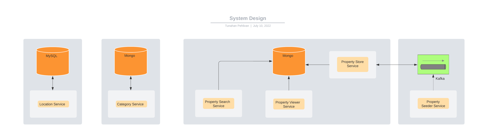

## About The Project
Using MySql, Kafka and Mongo services demonstrate a Spring Boot application which provides some REST services. 
Please follow the guide to obtain more details about the project.

## Getting Started
Follow the instructions to set up the project in your local environment.

### Prerequisites
* JDK 11
* Docker

### Installation
Please run the command in the project's root folder where placed `docker-compose.yml`.

#### Run 
Use `docker-compose up --build` command to launch all services. You may encounter a memory leak or some system issue 
due to consume too much system resource. If this happens you can make passive some lines in the `docker-compose.yml`.

To add a new property to the system you need the following services. Make passive the lines related rest of the services in the file.
* `property-seeder`
* `property-store`
* `kafka`
* `zookeeper`

To acquire a property on the system you need the following services.
* `location`
* `location-db`
* `category`
* `category-db`
* `property-search`
* `property-viewer`

## System Design and Service Explanation


### `Location Service (./location)` 
Location service is a Spring Boot application which communicates to a MySql database. It provides all the Turkish cities.

#### `GET '/api/cities'`
#### Example Input
`curl --location --request GET 'http://<HOST>:<PORT>/api/cities'`
#### Example Output
```
[
    {
        "id": 1,
        "name": "Adana"
    },
    {
        "id": 7,
        "name": "Antalya"
    },
    {
        "id": 3,
        "name": "Afyon"
    }
]
```
### `Category Service (./category)`
Category service is a Spring Boot application which communicates to a Mongo database. It provides all the categories.

#### `GET '/api/categories'`
#### Example Input
`curl --location --request GET 'http://<HOST>:<PORT>/api/categories'`
#### Example Output
```
[
    {
        "id": 1,
        "name": "arsa"
    },
    {
        "id": 2,
        "name": "ticari"
    },
    {
        "id": 2,
        "name": "konut"
    }
]
```
### `Property Viewer Service (./property-viewer)`
Property Viewer service is a Spring Boot application which communicates to a Mongo database. It provides a single property with a unique ID.

#### `GET '/detay/{property-id}'`
#### Example Input
`curl --location --request GET 'http://<HOST>:<PORT>/detay/1'`
#### Example Output
```
{
    "categoryId": 1,
    "cityId": 1,
    "title": "title",
    "currency": "TL",
    "price": 1.0
}
```

### `Property Seeder Service (./property-seeder)`
Property Seeder service is a Spring Boot application which communicates to a Kafka. 
It provides commands on Kafka cluster which are consumed after to store in a Mongo database.

#### `POST '/api/property'`
#### Example Input
```
curl --location --request POST 'http://<HOST>:<PORT>/api/property' \
    --header 'Content-Type: application/json' \
    --data-raw '{
        "categoryId": 1,
        "cityId": 1,
        "title": "title",
        "currency": "TL",
        "price": 1.0
    }'
```

### `Property Store Service (./property-store)`
Property Store service is a Spring Boot application which communicates to a Kafka and a Mongo database.
It consumes commands (`AddNewPropertyCommand`) from Kafka cluster and evaluates them to the Mongo database 
and finally publishes the events (`NewPropertyAdded`).

### `Property Search Service (./property-search)`
Property Search service is a Spring Boot application which communicates to a Mongo database.
It provides properties to end users with proper parameters. Also, it provides friendly urls if it is possible.

#### `GET '/arama?category={category-id}'`
#### Example Input
`curl --location --request GET 'http://<HOST>:<PORT>/arama?category=1'`
#### Example Output
```
{
    "page": 1,
    "pageSize": 5,
    "totalPage": 1,
    "rootUrl": "http://localhost:8085/arama/konut",
    "result": [
        {
            "id": "62cb01abeea8f02618dcfa7c",
            "category": "Konut",
            "city": "Adana",
            "title": "title",
            "currency": "TL",
            "price": 1.0
        }
    ]
}
```
#### `GET '/arama?category={category-id}&page={page}'`
#### Example Input
`curl --location --request GET 'http://<HOST>:<PORT>/arama?category=1&page=2'`
#### Example Output
```
{
  "page": 2,
  "pageSize": 5,
  "totalPage": 2,
  "rootUrl": "http://localhost:8085/arama/konut",
  "result": [
    {
      "id": "62cb01b1eea8f02618dcfa81",
      "category": "Konut",
      "city": "Adana",
      "title": "title",
      "currency": "TL",
      "price": 1.0
    }
  ]
}
```
#### `GET '/arama?category={category-id}&city={city-id}'`
#### Example Input
`curl --location --request GET 'http://<HOST>:<PORT>/arama?category=1&city=1'`
#### Example Output
```
{
  "page": 1,
  "pageSize": 5,
  "totalPage": 1,
  "rootUrl": "http://localhost:8085/arama/konut/adana",
  "result": [
    {
      "id": "62cb01b0eea8f02618dcfa7f",
      "category": "Konut",
      "city": "Adana",
      "title": "title",
      "currency": "TL",
      "price": 1.0
    }
  ]
}
```
#### `GET '/arama?category={category-id}&city={city-id}&city={city-id}'`
#### Example Input
`curl --location --request GET 'http://<HOST>:<PORT>/arama?category=1&city=1&city=2'`
#### Example Output
```
{
  "page": 1,
  "pageSize": 5,
  "totalPage": 1,
  "rootUrl": "http://localhost:8085/arama?category=1&city=1&city=7",
  "result": [
    {
      "id": "62cb01abeea8f02618dcfa7c",
      "category": "Konut",
      "city": "Adana",
      "title": "title",
      "currency": "TL",
      "price": 1.0
    },
    {
      "id": "62cb01b1eea8f02618dcfa81",
      "category": "Konut",
      "city": "Antalya",
      "title": "title",
      "currency": "TL",
      "price": 1.0
    }
  ]
}
```